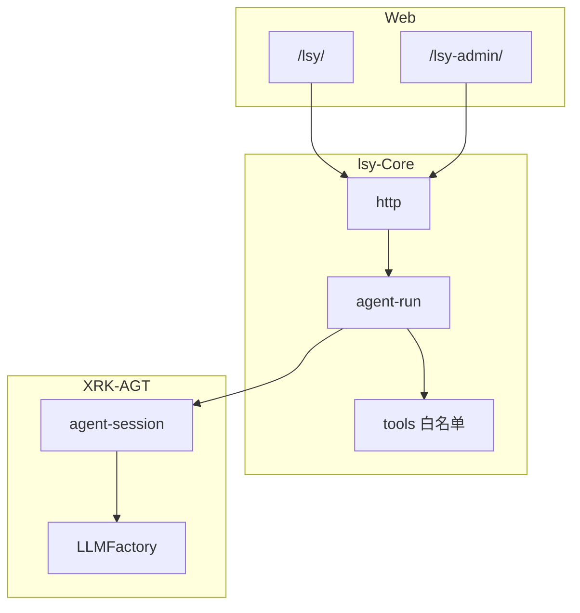

<div align="center">

<br>

# 墨 · lsy-Core

**简约墨水风 Web Agent · 多账号工作区 · 工具白名单 · 配额与审计**

<sub>XRK-AGT 独立产品 Core · 须放入宿主 `core/lsy-Core` 运行</sub>

<br>

[](https://github.com/sunflowermm/XRK-AGT)
[](./LICENSE)


<br>

[安装](#安装) · [页面](#页面) · [配置](#配置) · [架构](#架构) · [API](#api) · [安全](#安全)

<br>

</div>

---

## 安装

```bash
cd XRK-AGT/core
git clone https://github.com/sunflowermm/lsy-Core.git lsy-Core
cd .. && pnpm install && node app
```

首次启动从 `default/lsy.yaml` 引导生成 **`data/lsy/lsy.yaml`**。

> 本 Core **无** `package.json`，代码使用宿主 `#` 别名（`#utils/*`、`#infrastructure/*`、`#factory/*`）。勿在子包内混用 `#` 与独立 `package.json`。

---

## 页面

<div align="center">

| | 路径 | 鉴权 |
|:---:|:---|:---|
| 对话 | `/lsy/` | 用户 Bearer Token |
| 管理 | `/lsy-admin/` | 系统 `X-API-Key` |
| 样式 | `/shared/ink.css` | 静态 |

</div>

运行参数（LLM、开关、默认账号）→ **AGT 控制台 · CommonConfig · 李诗雅**  
管理台仅管 **用户 / 配额 / 用量**。

---

## 配置

| | 路径 |
|:---|:---|
| 模板 | `core/lsy-Core/default/lsy.yaml` |
| 运行时 | `data/lsy/lsy.yaml` |
| Schema | `commonconfig/lsy.js` |
| LLM 密钥 | `data/server_bots/{port}/*_llm.yaml` |

**LLM 三步**：工厂配 `providers[]` → 设 `llm.provider` 为对应 `key`（须 anthropic 协议）→ 可选 `GET /api/lsy/llm/endpoints` 校验。

| 字段 | 说明 |
|:---|:---|
| `enabled` | 总开关 |
| `llm.provider` / `llm.maxToolRounds` | 端点指针 · 工具轮次 1–32 |
| `defaultQuota` / `defaultUsername` / `defaultPassword` | 首次建号；密码留空则随机并写日志 |
| `tools.allowGhClone` | GitHub 克隆到 `project/` |
| `search.provider` | `auto` · `bing-cn` · `baidu` · `duckduckgo` |
| `admin.allowLoopbackBypass` | 127 免 Key（仅开发） |

用户数据落在宿主 **`data/lsy/`**（配置、账号、各用户工作区），勿纳入本仓库。

---

## 架构

不读 `aistream.yaml` 默认 Provider，不注入其它 Core 的 MCP。



| | 宿主 system-Core | lsy-Core |
|:---|:---|:---|
| LLM | 工厂 + `*_llm.yaml` | `llm.provider` 指针 |
| 工具 | MCP / streams | `lsy-tools.js` 白名单 |
| 门面 | `/api/v3/chat/completions` | `/api/lsy/chat/completions` |

<details>
<summary><b>目录结构</b></summary>

```
lsy-Core/
├── commonconfig/   Schema
├── default/        配置模板
├── http/           auth · chat · admin · workspace
├── lib/            用户 · 会话 · Agent · 工具
├── skills/         Agent 规范（office-* 办公 + lsy 专用）
└── www/            lsy · lsy-admin · shared
```

框架自动扫描 `http/`、`commonconfig/`、`www/**`，无需 `index.js` 注册。

</details>

---

## API

<details>
<summary><b>用户</b> · <code>Authorization: Bearer</code></summary>

| 方法 | 路径 |
|:---|:---|
| POST | `/api/lsy/login` · `/api/lsy/logout` |
| GET | `/api/lsy/me` |
| POST | `/api/lsy/chat/completions` |
| GET · DELETE | `/api/lsy/chats` · `/api/lsy/chats/:id` |
| GET | `/api/lsy/llm/endpoints` |
| POST | `/api/lsy/files/upload` |
| GET · DELETE | `/api/lsy/files` |
| GET | `/api/lsy/files/download` |
| GET · PUT | `/api/lsy/workspace/agents` |
| GET | `/api/lsy/workspace/audit` |

</details>

<details>
<summary><b>管理</b> · <code>X-API-Key</code></summary>

| 方法 | 路径 |
|:---|:---|
| GET | `/api/lsy/admin/stats` |
| GET · POST | `/api/lsy/admin/users` |
| PUT · DELETE | `/api/lsy/admin/users/:username` |
| POST | `/api/lsy/admin/users/:username/reset-used` |
| GET | `/api/lsy/admin/users/:username/workspace` |
| GET | `/api/lsy/admin/users/:username/audit` |

</details>

**工具**：`read` `write` `grep` `list_files` `view_image` `convert_document` `export_doc` `web_search` `web_fetch` `run` · 可选 `gh_clone`  
细则 → `skills/` · 行为边界 → `AGENTS.md`

---

## 安全

<div align="center">

本仓库 **无硬编码 Key** · 模板无真实密码 · API 不返回 `apiKey` / `passwordHash`

</div>

开源时勿将宿主运行时打进本仓：`config/server_config/` · `data/server_bots/` · `data/lsy/`

---

<div align="center">

<br>

**[XRK-AGT](https://github.com/sunflowermm/XRK-AGT)** · **[Cores 索引](https://github.com/sunflowermm/AGT-Cores-Tools-Index)** · **[MIT](./LICENSE)**

<sub>开发者读 README · 产品 Agent 读 AGENTS.md + skills/</sub>

<br>

</div>
